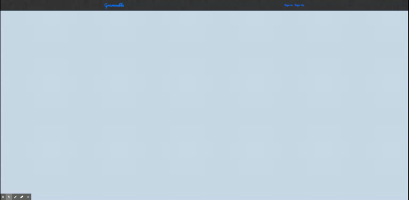
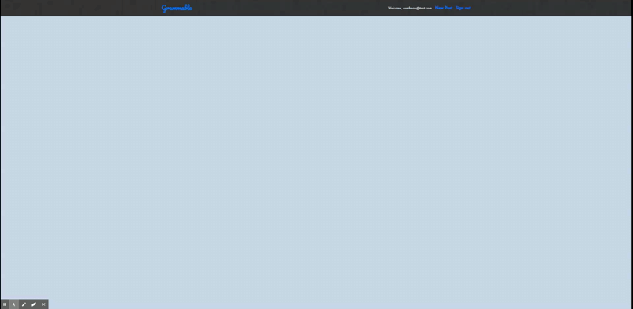
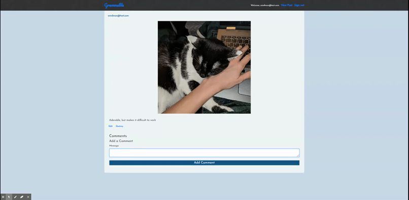
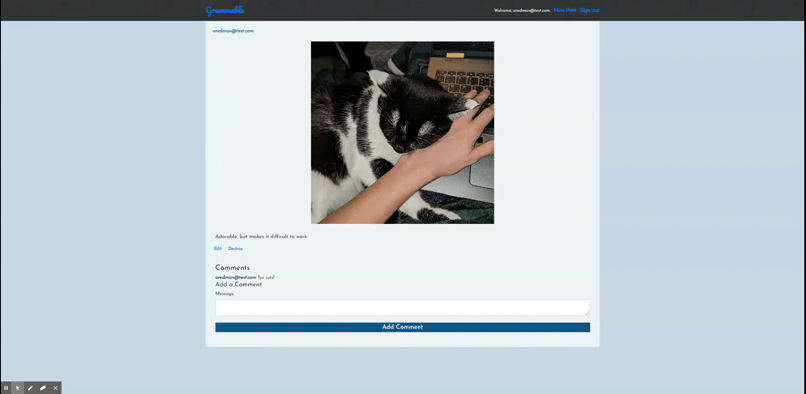

# Grammable

An Instagram clone built using Test Driven Development.

[View the deployed application](https://grammable-alyssa-redman.herokuapp.com/grams)

____________

### Features

* Ruby 2.5.3

* Test Driven Development using Rspec and FactoyBot gems

* PostgresSQL database

* Devise for user authentication

* Simple Form gem 

* Amazon Web Service (AWS) for image storage

* CarrierWave for file uploads

* MiniMagic gem for image resizing

____________

### Installation

Clone with SSH `git@github.com:alyred3/grammable.git` or HTTPS `https://github.com/alyred3/grammable.git`

Run `git clone git@github.com:alyred3/grammable.git` or `git clone https://github.com/alyred3/grammable.git` in local command line

Run `bundle install`

____________

### How to use 

## Sign up to create an account

## Post new photos

## Add comments

## Edit and destroy

