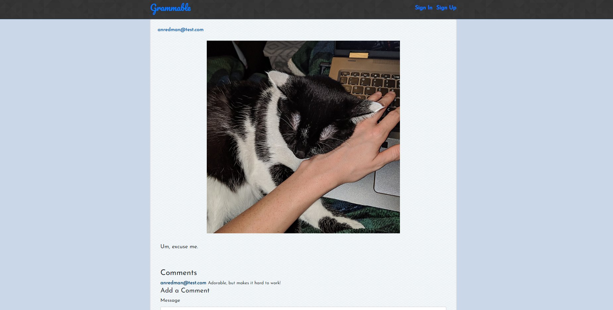

# Grammable

An Instagram clone built using Test Driven Development.

[View the deployed application](https://grammable-alyssa-redman.herokuapp.com/grams)

__

### Features

* Ruby 2.5.3

* Test Driven Development using Rspec and FactoyBot

* PostgresSQL database

* Devise for user authentication

* Simple Form gem 

* Amazon Web Service (AWS) for image storage

* CarrierWave for file uploads

* MiniMagic gem for image resizing

__

### Screenshots

